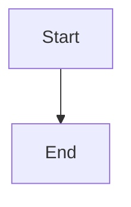

How to run:-
1. Install dependencies and use ```pip install -r requirements.txt```
2. Run the streamlit app with ```streamlit run streamlit_app.py```

Models used:-


```
flowchart TB
    A[Start] --> B[End]
```
```

***

## 2. **Mermaid Live Editor (Best for Testing)**

**URL:** <https://mermaid.live>[1]

**Steps:**
1. Go to https://mermaid.live
2. Paste your code in the left panel
3. See instant preview on the right
4. Export as PNG/SVG if needed

**Features:**[1]
- Real-time preview
- No installation needed
- Share links with teammates
- Export diagrams

***

## 3. **VS Code (Best for Development)**

**Method A: Built-in Markdown Preview with Extension**[2][5]

1. **Install Extension:**
   - Open VS Code
   - Go to Extensions (Ctrl+Shift+X)
   - Search: **"Markdown Preview Mermaid Support"** by Matt Bierner
   - Click Install

2. **Preview:**
   - Create/open `README.md`
   - Press `Ctrl+Shift+V` (or `Cmd+Shift+V` on Mac)
   - See rendered diagram in preview pane

**Method B: Mermaid Preview Extension**[6][2]

1. **Install:**
   - Search: **"Mermaid diagram previewer"** by Vlad Stirbu
   - Click Install

2. **Use:**
   - Right-click on `.mmd` file or mermaid code block
   - Select "Preview Mermaid Diagram"
   - Side-by-side editing with live preview

***

## 4. **Online Mermaid Viewers**

### **Mermaid Flow**[7]
- URL: https://www.mermaidflow.app
- Features: Visual editor, AI assistance, drag-and-drop

### **Mermaid Viewer**[8]
- URL: https://mermaidviewer.com
- Features: Real-time collaboration, export to multiple formats

### **Miro**[9]
- Integrated Mermaid app for collaborative diagrams

***

## 5. **Local HTML Preview**

Create a simple HTML file :[10][11]

```html
<!DOCTYPE html>
<html>
<head>
    <script src="https://cdn.jsdelivr.net/npm/mermaid/dist/mermaid.min.js"></script>
    <script>mermaid.initialize({startOnLoad:true});</script>
</head>
<body>
    <div class="mermaid">
        flowchart TB
            A[Text Documents] --> B[Splitting]
            B --> C[(String DB)]
            C --> D[Embeddings]
            D --> E[(Vector DB)]
    </div>
</body>
</html>
```

Open in browser: Double-click the HTML file.

***

## **Recommended Workflow** 🎯

For your README.md development:

### **Step 1: Test Your Diagram**
Go to https://mermaid.live and paste:


### **Step 2: Copy to README.md**
````markdown
## System Architecture

```
flowchart TB
    A[Start] --> B[End]
```
```

### **Step 3: Preview Locally (VS Code)**
- Install "Markdown Preview Mermaid Support"
- Press `Ctrl+Shift+V` to preview

### **Step 4: Push to GitHub**
```bash
git add README.md
git commit -m "Add architecture diagram"
git push
```

### **Step 5: View on GitHub**
Go to your repository URL - diagram renders automatically![3][4]

***

## **Quick Fix: VS Code Not Showing Diagram?**

If native VS Code preview doesn't work :[12][13]

**Solution 1:** Install **"Markdown Preview Mermaid Support"** by Matt Bierner
```
Ctrl+Shift+X → Search "Markdown Preview Mermaid Support" → Install
```

**Solution 2:** Install **"Markdown Preview Enhanced"** by Yiyi Wang
```
Ctrl+Shift+X → Search "Markdown Preview Enhanced" → Install
```

Then press `Ctrl+Shift+V` to preview.

***

## **Your Diagrams on GitHub**

Once pushed to GitHub, your diagrams will look like this automatically :[4][3]

**In README.md:**
````markdown
```
flowchart TB
    A[Start] --> B[Process]
    B --> C{Decision}
    C -->|Yes| D[End]
    C -->|No| B
```
```

**Rendered Output:** Beautiful interactive diagram! ✨

***

## **Pro Tips** 💡

1. **Always test first** at https://mermaid.live before committing[1]
2. **Use VS Code** for local development with live preview[5][2]
3. **GitHub automatically renders** - no configuration needed[3]
4. **Export to PNG/SVG** from mermaid.live for presentations[1]
5. **Syntax highlighting** works automatically in VS Code with extensions[2]

Choose the method that fits your workflow best! For your README.md, I'd recommend: **Mermaid Live (testing) → VS Code (editing) → GitHub (final display)**.[2][3][1]
